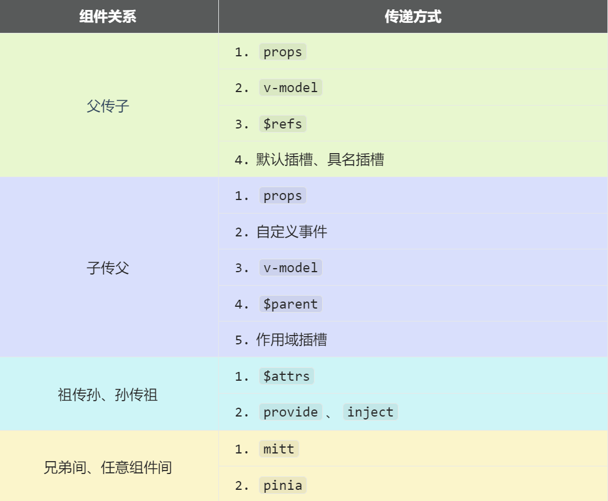

# 组件通信

**`Vue3`组件通信和`Vue2`的区别：**

* 移出事件总线，使用`mitt`代替。

- `vuex`换成了`pinia`。
- 把`.sync`优化到了`v-model`里面了。
- 把`$listeners`所有的东西，合并到`$attrs`中了。
- `$children`被砍掉了。

**常见搭配形式：**



## props

概述：`props`是使用频率最高的一种通信方式，常用与 ：**父 ↔ 子**。

- 若 **父传子**：属性值是**非函数**。
- 若 **子传父**：属性值是**函数**。

父组件：

```vue
<template>
  <div class="father">
    <h3>父组件，</h3>
		<h4>我的车：{{ car }}</h4>
		<h4>儿子给的玩具：{{ toy }}</h4>
		<Child :car="car" :getToy="getToy"/>
  </div>
</template>

<script setup lang="ts" name="Father">
	import Child from './Child.vue'
	import { ref } from "vue";
	// 数据
	const car = ref('奔驰')
	const toy = ref()
	// 方法
	function getToy(value:string){
		toy.value = value
	}
</script>
```

子组件

```vue
<template>
  <div class="child">
    <h3>子组件</h3>
		<h4>我的玩具：{{ toy }}</h4>
		<h4>父给我的车：{{ car }}</h4>
		<button @click="getToy(toy)">玩具给父亲</button>
  </div>
</template>

<script setup lang="ts" name="Child">
	import { ref } from "vue";
	const toy = ref('奥特曼')
	
	defineProps(['car','getToy'])
</script>
```

## 自定义事件

1. 概述：自定义事件常用于：**子 => 父。**
2. 注意区分好：原生事件、自定义事件。

- 原生事件：
  - 事件名是特定的（`click`、`mosueenter`等等）	
  - 事件对象`$event`: 是包含事件相关信息的对象（`pageX`、`pageY`、`target`、`keyCode`）
- 自定义事件：
  - 事件名是任意名称
  - `<strong style="color:red">事件对象` `$event`: 是调用`emit`时所提供的数据，可以是任意类型！！！`</strong >`

3. 示例：

   ```html
   <!--在父组件中，给子组件绑定自定义事件：-->
   <Child @send-toy="toy = $event"/>
   
   <!--注意区分原生事件与自定义事件中的$event-->
   <button @click="toy = $event">测试</button>
   ```

   ```js
   //子组件中，触发事件：
   this.$emit('send-toy', 具体数据)
   ```

## mitt

概述：与消息订阅与发布（`pubsub`）功能类似，可以实现任意组件间通信。

安装`mitt`

```shell
npm i mitt
```

新建文件：`src\utils\emitter.ts`

```javascript
// 引入mitt 
import mitt from "mitt";

// 创建emitter
const emitter = mitt()

/*
  // 绑定事件
  emitter.on('abc',(value)=>{
    console.log('abc事件被触发',value)
  })
  emitter.on('xyz',(value)=>{
    console.log('xyz事件被触发',value)
  })

  setInterval(() => {
    // 触发事件
    emitter.emit('abc',666)
    emitter.emit('xyz',777)
  }, 1000);

  setTimeout(() => {
    // 清理事件
    emitter.all.clear()
  }, 3000); 
*/

// 创建并暴露mitt
export default emitter
```

接收数据的组件中：绑定事件、同时在销毁前解绑事件：

```typescript
import emitter from "@/utils/emitter";
import { onUnmounted } from "vue";

// 绑定事件
emitter.on('send-toy',(value)=>{
  console.log('send-toy事件被触发',value)
})

onUnmounted(()=>{
  // 解绑事件
  emitter.off('send-toy')
})
```

【第三步】：提供数据的组件，在合适的时候触发事件

```javascript
import emitter from "@/utils/emitter";

function sendToy(){
  // 触发事件
  emitter.emit('send-toy',toy.value)
}
```

**注意这个重要的内置关系，总线依赖着这个内置关系**

## v-model

1. 概述：实现 **父↔子** 之间相互通信。

2. 前序知识 —— `v-model`的本质

   ```vue
   <!-- 使用v-model指令 -->
   <input type="text" v-model="userName">
   
   <!-- v-model的本质是下面这行代码 -->
   <input 
     type="text" 
     :value="userName" 
     @input="userName =(<HTMLInputElement>$event.target).value"
   >
   ```

3. 组件标签上的`v-model`的本质：`:moldeValue` ＋ `update:modelValue`事件。

   ```vue
   <!-- 组件标签上使用v-model指令 -->
   <ItInput v-model="userName"/>
   
   <!-- 组件标签上v-model的本质 -->
   <ItInput :modelValue="userName" @update:model-value="userName = $event"/>
   ```

   `ItInput`组件中：

   ```vue
   <template>
     <div class="box">
       <!--将接收的value值赋给input元素的value属性，目的是：为了呈现数据 -->
   		<!--给input元素绑定原生input事件，触发input事件时，进而触发update:model-value事件-->
       <input 
          type="text" 
          :value="modelValue" 
          @input="emit('update:model-value',$event.target.value)"
       >
     </div>
   </template>
   
   <script setup lang="ts" name="ItInput">
     // 接收props
     defineProps(['modelValue'])
     // 声明事件
     const emit = defineEmits(['update:model-value'])
   </script>
   ```

4. 也可以更换`value`，例如改成`abc`

   ```vue
   <!-- 也可以更换value，例如改成abc-->
   <ItInput v-model:abc="userName"/>
   
   <!-- 上面代码的本质如下 -->
   <ItInput :abc="userName" @update:abc="userName = $event"/>
   ```

   `ItInput`组件中：

   ```vue
   <template>
     <div class="box">
       <input 
          type="text" 
          :value="abc" 
          @input="emit('update:abc',$event.target.value)"
       >
     </div>
   </template>
   
   <script setup lang="ts" name="ItInput">
     // 接收props
     defineProps(['abc'])
     // 声明事件
     const emit = defineEmits(['update:abc'])
   </script>
   ```

5. 如果`value`可以更换，那么就可以在组件标签上多次使用`v-model`

   ```vue
   <ItInput v-model:abc="userName" v-model:xyz="password"/>
   ```

   


## $attrs

1. 概述：`$attrs`用于实现**当前组件的父组件**，向**当前组件的子组件**通信（**祖→孙**）。

2. 具体说明：`$attrs`是一个对象，包含所有父组件传入的标签属性。

   >  注意：`$attrs`会自动排除`props`中声明的属性(可以认为声明过的 `props` 被子组件自己“消费”了)

父组件：

```vue
<template>
  <div class="father">
    <h3>父组件</h3>
		<Child :a="a" :b="b" :c="c" :d="d" v-bind="{x:100,y:200}" :updateA="updateA"/>
  </div>
</template>

<script setup lang="ts" name="Father">
	import Child from './Child.vue'
	import { ref } from "vue";
	let a = ref(1)
	let b = ref(2)
	let c = ref(3)
	let d = ref(4)

	function updateA(value){
		a.value = value
	}
</script>
```

子组件：

```vue
<template>
	<div class="child">
		<h3>子组件</h3>
		<GrandChild v-bind="$attrs"/>
	</div>
</template>

<script setup lang="ts" name="Child">
	import GrandChild from './GrandChild.vue'
</script>
```

孙组件：

```vue
<template>
	<div class="grand-child">
		<h3>孙组件</h3>
		<h4>a：{{ a }}</h4>
		<h4>b：{{ b }}</h4>
		<h4>c：{{ c }}</h4>
		<h4>d：{{ d }}</h4>
		<h4>x：{{ x }}</h4>
		<h4>y：{{ y }}</h4>
		<button @click="updateA(666)">点我更新A</button>
	</div>
</template>

<script setup lang="ts" name="GrandChild">
	defineProps(['a','b','c','d','x','y','updateA'])
</script>
```

## $refs、$parent

1. 概述：

   * `$refs`用于 ：**父→子。**
   * `$parent`用于：**子→父。**

2. 原理如下：

   | 属性      | 说明                                                     |
   | --------- | -------------------------------------------------------- |
   | `$refs`   | 值为对象，包含所有被`ref`属性标识的`DOM`元素或组件实例。 |
   | `$parent` | 值为对象，当前组件的父组件实例对象。                     |

## provide、inject

1. 概述：实现**祖孙组件**直接通信

2. 具体使用：

   * 在祖先组件中通过`provide`配置向后代组件提供数据
   * 在后代组件中通过`inject`配置来声明接收数据

3. 具体编码：

   【第一步】父组件中，使用`provide`提供数据

   ```vue
   <template>
     <div class="father">
       <h3>父组件</h3>
       <h4>资产：{{ money }}</h4>
       <h4>汽车：{{ car }}</h4>
       <button @click="money += 1">资产+1</button>
       <button @click="car.price += 1">汽车价格+1</button>
       <Child/>
     </div>
   </template>
   
   <script setup lang="ts" name="Father">
     import Child from './Child.vue'
     import { ref,reactive,provide } from "vue";
     // 数据
     let money = ref(100)
     let car = reactive({
       brand:'奔驰',
       price:100
     })
     // 用于更新money的方法
     function updateMoney(value:number){
       money.value += value
     }
     // 提供数据
     provide('moneyContext',{money,updateMoney})
     provide('car',car)
   </script>
   ```

   > 注意：子组件中不用编写任何东西，是不受到任何打扰的

   【第二步】孙组件中使用`inject`配置项接受数据。

   ```vue
   <template>
     <div class="grand-child">
       <h3>我是孙组件</h3>
       <h4>资产：{{ money }}</h4>
       <h4>汽车：{{ car }}</h4>
       <button @click="updateMoney(6)">点我</button>
     </div>
   </template>
   
   <script setup lang="ts" name="GrandChild">
     import { inject } from 'vue';
     // 注入数据
    let {money,updateMoney} = inject('moneyContext',{money:0,updateMoney:(x:number)=>{}})
     let car = inject('car')
   </script>
   ```


## pinia

参考之前[pinia](./3.md)部分的讲解

## slot

### 1. 默认插槽

```vue
父组件中：
        <Category title="今日热门游戏">
          <ul>
            <li v-for="g in games" :key="g.id">{{ g.name }}</li>
          </ul>
        </Category>
子组件中：
        <template>
          <div class="item">
            <h3>{{ title }}</h3>
            <!-- 默认插槽 -->
            <slot></slot>
          </div>
        </template>
```

### 2. 具名插槽

```vue
父组件中：
        <Category title="今日热门游戏">
          <template v-slot:s1>
            <ul>
              <li v-for="g in games" :key="g.id">{{ g.name }}</li>
            </ul>
          </template>
          <template #s2>
            <a href="">更多</a>
          </template>
        </Category>
子组件中：
        <template>
          <div class="item">
            <h3>{{ title }}</h3>
            <slot name="s1"></slot>
            <slot name="s2"></slot>
          </div>
        </template>
```

### 3. 作用域插槽 

1. 理解：`<span style="color:red">`数据在组件的自身，但根据数据生成的结构需要组件的使用者来决定。`</span>`（新闻数据在`News`组件中，但使用数据所遍历出来的结构由`App`组件决定）

2. 具体编码：

   ```vue
   父组件中：
         <Game v-slot="params">
         <!-- <Game v-slot:default="params"> -->
         <!-- <Game #default="params"> -->
           <ul>
             <li v-for="g in params.games" :key="g.id">{{ g.name }}</li>
           </ul>
         </Game>
   
   子组件中：
         <template>
           <div class="category">
             <h2>今日游戏榜单</h2>
             <slot :games="games" a="哈哈"></slot>
           </div>
         </template>
   
         <script setup lang="ts" name="Category">
           import {reactive} from 'vue'
           let games = reactive([
             {id:'asgdytsa01',name:'英雄联盟'},
             {id:'asgdytsa02',name:'王者荣耀'},
             {id:'asgdytsa03',name:'红色警戒'},
             {id:'asgdytsa04',name:'斗罗大陆'}
           ])
         </script>
   ```
