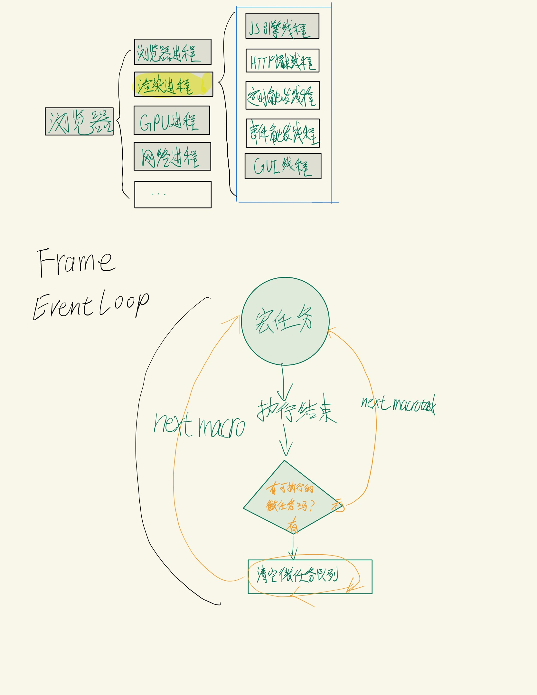

# JS事件循环(Event Loop)

在 Chrome 浏览器中，通常有以下主要进程：

1. **浏览器进程（Browser Process）：**
   - 负责协调和管理其他进程。
   - 处理用户界面、地址栏、书签栏等。
   - 管理子进程，如渲染进程、插件进程等。

2. **渲染进程（Renderer Process）：**
   - 每个标签页都有一个独立的渲染进程。
   - 负责渲染页面的 HTML、CSS、JavaScript。
   - 与浏览器进程通过 IPC 进行通信。

3. **GPU 进程（GPU Process）：**
   - 负责处理与 GPU 相关的任务，如页面绘制和图形操作。
   - 通常由浏览器进程创建和管理。

4. **网络进程（Network Process）：**
   - 负责处理网络请求和响应。
   - 与浏览器进程分离，以提高网络操作的并发性。

5. **插件进程（Plugin Process）：**
   - 如果网页使用插件（如 Flash、Java 等），则插件运行在独立的插件进程中。

6. **扩展进程（Extension Process）：**
   - 每个扩展可能运行在独立的进程中。

7. **沙盒进程（Sandbox Process）：**
   - Chrome 使用沙盒机制隔离渲染进程，以提高安全性。
   - 沙盒进程用于执行不受信任代码，限制其对系统的访问权限。

浏览器进程中的线程：

1. **主线程（Main Thread）：**
   - 负责处理用户界面、用户输入、浏览器的前进和后退等操作。
   - 执行 JavaScript 代码，处理 DOM 操作。

2. **I/O 线程（I/O Thread）：**
   - 负责处理浏览器的 I/O 操作，如文件读写、网络请求等。

3. **网络线程（Network Thread）：**
   - 负责处理网络请求和响应，与服务器通信。

4. **渲染线程（Renderer Thread）：**
   - 负责渲染页面的 HTML、CSS 和执行 JavaScript。
   - 与渲染进程中的渲染线程相对应，但这里指的是浏览器进程中的线程。

5. **GPU 线程（GPU Thread）：**
   - 负责处理与 GPU 相关的任务，如页面绘制和图形操作。

6. **插件线程（Plugin Thread）：**
   - 负责运行插件，如 Flash、Java 等。

7. **定时器线程（Timer Thread）：**
   - 负责管理定时器，处理定时器回调函数的执行。

8. **事件触发线程（Event Thread）：**
   - 负责处理事件触发，如鼠标点击、键盘输入等。

通常在渲染进程中找到的一些线程：

1. **主线程（Main Thread）：**
   - 负责解析 HTML、构建 DOM 树和 CSSOM 树。
   - 执行 JavaScript 代码，处理用户交互和更新页面内容。

2. **合成线程（Compositor Thread）：**
   - 负责将图层合成为最终的页面。
   - 处理图层的变换、透明度等属性，以及页面的滚动效果。

3. **光栅线程（Raster Thread）：**
   - 负责将页面的图层转换为位图，以便在屏幕上显示。
   - 与合成线程协同工作，提高渲染效率。

4. **工作线程（Worker Thread）：**
   - 在 Web Workers 中执行的 JavaScript 代码运行在独立的工作线程中。
   - 用于执行后台任务，不阻塞主线程，提高页面的响应性。

5. **定时器线程（Timer Thread）：**
   - 负责处理定时器回调函数的执行。

6. **事件线程（Event Thread）：**
   - 负责处理用户输入、事件触发等。

### javaScript中的微任务

Promise中的回调函数（then, catch, finally）
async/await函数中的await表达式
queueMicrotask()函数调用
MutationObserver监听器回调函数
IntersectionObserver回调函数

process.nextTick() 操作

### javaScript中的宏任务（macrotask）

setTimeout
setInterval
setImmediate（仅限于Node.js环境中）
requestAnimationFrame
I/O操作（例如文件读取、网络通信等）
UI渲染

setImmediate
setTimeout
setInterval
I/O操作（例如文件读取、网络通信等）

当涉及到 JavaScript 中的宏任务和微任务时，以下是一些常见的执行上下文和任务类型：

### 宏任务（Macro Task）

1. **浏览器环境：**
   - `setTimeout` 和 `setInterval` 的回调。
   - 事件回调（如用户交互、DOM 事件）。
   - XMLHttpRequest 和 Fetch 请求的回调。
   - 页面的渲染过程。
   - `requestAnimationFrame` 的回调（浏览器环境）。

2. **Node.js 环境：**
   - `setTimeout` 和 `setInterval` 的回调。
   - I/O 操作的回调。

### 微任务（Micro Task）

1. **浏览器环境：**
   - Promise 的 `then` 和 `catch` 方法。
   - `MutationObserver` 的回调。
   - process.nextTick（在某些浏览器中可用）。
   - `async/await` 中 `await` 后面的代码。

2. **Node.js 环境：**
   - Promise 的 `then` 和 `catch` 方法。
   - process.nextTick。
   - `async/await` 中 `await` 后面的代码。

### 补充说明

- **`requestAnimationFrame`：**
  - 在浏览器环境中，`requestAnimationFrame` 的回调属于宏任务，但执行时间通常会在下一次重绘之前。
  - 在 Node.js 环境中通常不适用，因为它主要用于浏览器环境下的动画渲染。

- **`async/await`：**
  - `async/await` 基于 Promise 实现，其中 `await` 后面的代码会在微任务队列中执行，属于微任务。
